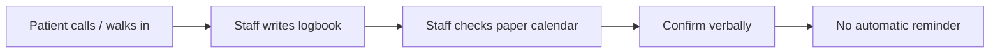
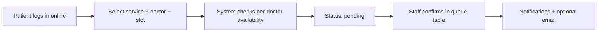
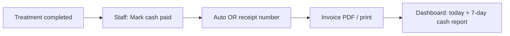

# Process Flow: Manual vs Digital System

Supports panel requirement (Janette M. Claro) to compare **manual clinic process** vs **Estandarte Dental Clinic System** and show improvements.

---

## 1. Appointment booking

### Manual (before system)

### Digital system

| Aspect | Manual | System | Improvement |
|--------|--------|--------|-------------|
| Availability | Paper calendar, easy double-book | Per-doctor slots, server validation | Fewer conflicts |
| Access | Clinic hours only | 24/7 booking online | Patient convenience |
| Status visibility | Unclear (“reserved?”) | pending → confirmed → in-progress → completed | Clear status column |
| History | Logbook pages | Searchable data table, latest first | Faster lookup |

---

## 2. Clinical records & tooth chart

### Manual

- Paper odontogram; doctor marks teeth by hand.
- Previous visits in separate folders; hard to compare.

### Digital system

- **Tooth chart tab**: select condition (e.g. Extraction) → click tooth numbers.
- **History tab**: paginated table of past visits with diagnosis and tooth markings.
- Progress notes stored on appointment record.

| Improvement | Benefit |
|-------------|---------|
| Click-to-mark chart | Same workflow as paper, less erasure |
| Linked visit history | Doctor sees latest + past in one screen |

---

## 3. Billing (cash only)

### Manual

- Handwritten receipt / logbook.
- End-of-day tally by staff.
- Doctor may not see totals until weekly summary.

### Digital system

| Aspect | Manual | System |
|--------|--------|--------|
| Payment methods | Cash (and informal GCash outside system) | **Cash only** in system (panel decision) |
| Receipt numbering | Manual OR book | Auto `OR-YYYY-####` |
| Sales report | Manual sum | Doctor dashboard + Reports page |
| Audit | Paper only | Firestore audit logs |

---

## 4. Patient feedback & evaluation

| Manual | System |
|--------|--------|
| Verbal feedback | In-app star rating + comments |
| Not aggregated | Reports: average rating, charts |
| — | Optional display on landing (4+ stars, opt-in) |

---

## 5. Summary of system improvements

1. **Structured status workflow** — pending, confirmed, in-progress, completed, paid, cancelled.
2. **Data tables with pagination** — latest records on top; no endless scrolling.
3. **Per-doctor scheduling** — multiple dentists, same time slot allowed for different doctors.
4. **Integrated clinical + billing** — one appointment record for notes, teeth, and payment.
5. **Real-time dashboards** — daily clients, cash revenue, weekly table for doctor.
6. **Online deployment** — patients book from home; staff work from clinic browsers.

Use this document in Chapter 3 (Methodology) and defense slides with side-by-side tables.
